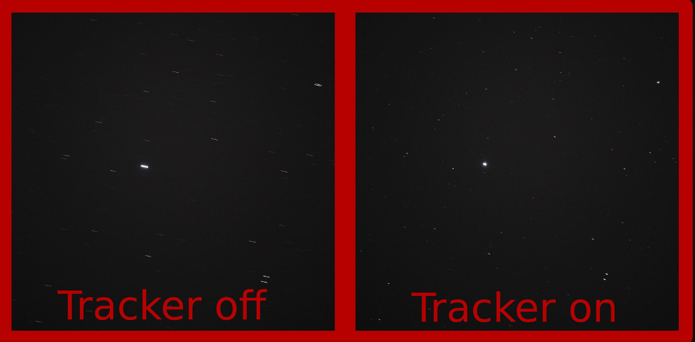

# Startracker 
**Startracker** is the control and calibration software that goes with a simple-to-build DIY barn-door star-tracking camera mount for astrophotography (including eclipse photography). The build prefers simple construction and corrects various complexities (the tangent error, construction imperfections) in software. 

The details of building the startracker and derivations behind the math are available here: https://partofthething.com/thoughts/?p=1327

The Earth rotates once per day. If you want to take long-exposure photos of stars, or if you want to take hundreds of shorter exposures of the same area (for stacking), you need to keep your camera pointed at the same stars as the world it sits on rotates. This does that for you. 

## Using startracker
There are two parts of this project: the *controller* code and the *calibration* code. The controller is intended to be loaded onto a ESP8266 microcontroller via the Arduino IDE. You should adjust some of the constants at the top to reflect the idiosyncracies of your particular device (especially the precise length measurement).

### Connections
The stepper motor controller should be connected to 4 pins (D1, D2, D3, D4 by default). A control button should be connected to another GPIO as well (D7 by default), and should connect to ground when it's pressed. 

### Operation
* When the ESP8266 is turned on, it begins turning the motor and assumes it started at fully retracted position. It accelerates accordingly to correct the tangent error. 
* If you press the button, the startracker fast-rewinds to its initial position and stops
* If you press the button again, the startracker starts turning again
* If you hold the button while turning on the startracker, it will start fast-rewinding with reckless abandon until you let go of the button. Use this to manually rewind the threaded rod. 

## Calibrations

The *calibration* code is (totally optional!) Python code that you can run on your computer in conjunction with a digital level to make very precise calibration corrections to the rate that your barn door startracker opens. To use, just run `measure.py` once in collect mode (you'll have to adjust the code at the bottom) and then again in analyze mode to get a least-squares analysis. See [the blog](https://partofthething.com/thoughts/?p=1327) for details. You can adjust the rate in the motor controller according to how you do on the calibration if you want, but I was able to get within 0.5% of the desired rate without calibrating. Nice. 

## Contributing
This project was done for fun by Nick Touran and is accordingly very small. If you'd like to contribute, feel free to just make a pull request. 

